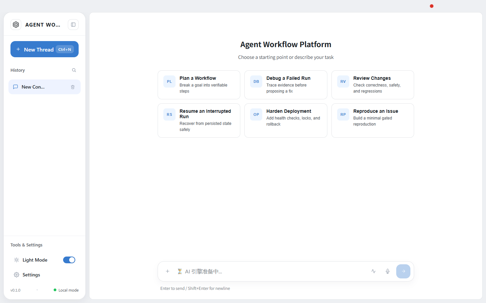
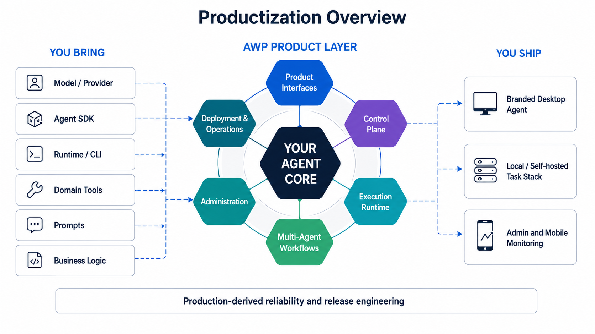
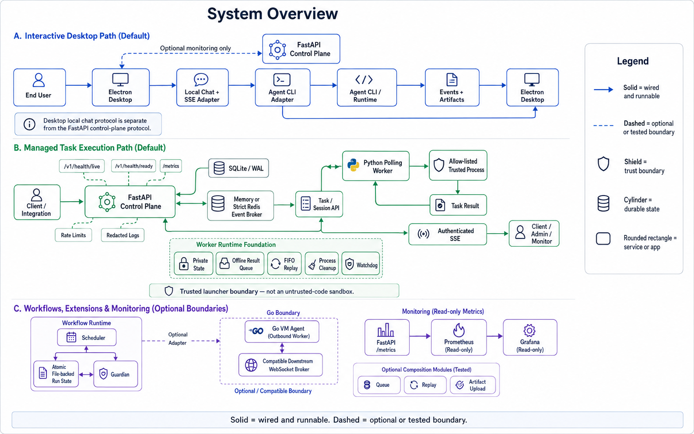
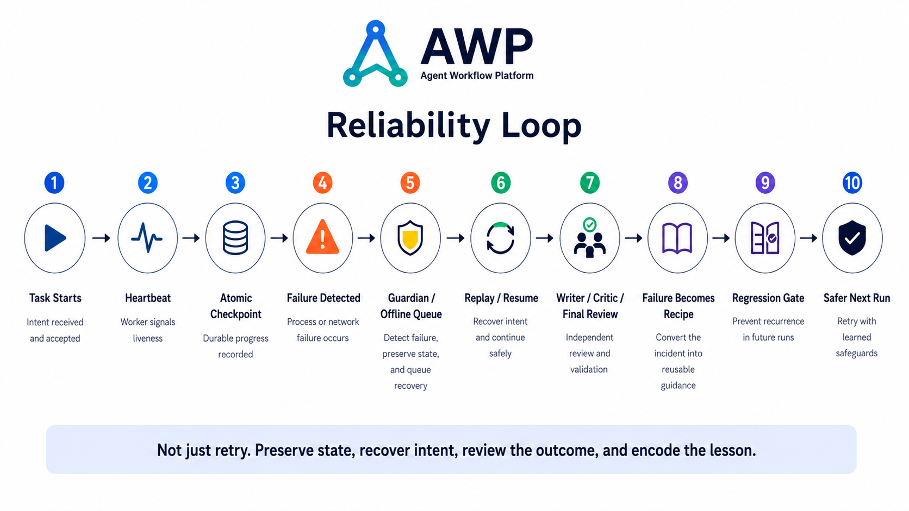

  
  <h1>Agent Workflow Platform</h1>
  
<strong>Ship an Agent product—not another prototype.</strong>

  

    A production-derived, local-first starter toolkit for Agent products: one
    runnable vertical slice plus independently adoptable product components.
  

  

    <a href="#run-it"><strong>Run it</strong></a> ·
    <a href="#the-platform-end-to-end">Platform</a> ·
    <a href="#how-it-fits-together">Architecture</a> ·
    <a href="docs/getting-started.md">Documentation</a> ·
    <a href="docs/assets/brand/README.md">Brand assets</a> ·
    <a href="README.zh-CN.md">简体中文</a>
  

  

    
    
    
    
  

## The product layer around your agent

Models, Agent SDKs, and CLIs implement the agent loop. Shipping that loop as a
product requires a second stack: user experience, task and session APIs,
execution workers, durable work coordination, administration, observability,
updates, deployment, and recovery.

Agent Workflow Platform (AWP) is a concrete starter implementation of that
product layer. Bring your model, Agent runtime, or CLI and your domain logic;
adopt the pieces you need instead of rebuilding every horizontal concern.

**Current integrated scope:** Desktop ↔ one OpenAI-compatible model ↔ one
managed-task tool ↔ FastAPI control plane ↔ Python worker. The workflow runtime,
Go VM-agent packages, admin, and mobile monitor are real separately tested
surfaces, but they are not all prewired into that reference turn.

**What “starter” means:** cloning the repository gives you a reproducible local
model-to-worker path and deterministic demos. Connecting an arbitrary Agent
still requires its CLI/model adapter; remote hosting, tenant identity, hosted
account services, and untrusted-code isolation are deliberately not turnkey.

| You bring | AWP gives you |
| --- | --- |
| Model, Agent SDK, runtime, or CLI | Electron desktop experience, streaming, conversations, artifacts, settings, and diagnostics |
| Domain tools, prompts, and business logic | Task/session control plane, worker execution, durable workflow records, review gates, and resume instructions |
| Provider and deployment choices | Explicit adapters, local-first defaults, admin/mobile monitors, packaging channels, metrics, and operations patterns |

Use the whole stack as a working product baseline or adopt one component at a
time. The contracts are explicit, so AWP does not need to replace the way your
agent reasons or invokes tools.

This is production-derived code, not a prompt collection or a clean-room demo.
It was extracted from a retired commercial prototype after six months of real
agent operation, then generalized and equipped with a public, fail-closed
release boundary.

## Choose your starting point

| If you want to… | Start here |
| --- | --- |
| Prove the integrated model-to-worker slice | Start Compose, then run `python scripts/launch_local_agent_desktop.py --model <id>` |
| Put a real model behind the desktop shell | Run the [OpenAI-compatible golden path](#2-run-a-real-model-in-the-desktop) |
| Validate the backend-to-worker execution path | Run the [Docker Compose round trip](#1-run-a-complete-local-task-round-trip) |
| Add durable, review-gated work coordination | Use the [standalone workflow runtime](#4-add-durable-workflows-to-any-repository) |
| Keep your existing Agent runtime | Integrate the [control plane](services/control-plane/README.md), [workers](services/worker-agent/README.md), and [operations patterns](deploy/README.md) independently |

## The platform, end to end

| | |
| --- | --- |
| **Product interfaces** Electron + Vue desktop workbench, read-only admin console, and Expo mobile monitor, with streaming, conversations, artifacts, settings, diagnostics, and guarded native bridges. | **Control plane** FastAPI task/session APIs, SQLite/WAL, capacity-aware claims, fenced attempts and leases, authenticated SSE, stale-record cleanup, health, rate limits, redacted logs, and Prometheus metrics. |
| **Execution runtime** A wired Python polling worker with command admission, cancellation, process supervision, private state, and offline result replay; plus a separately tested Go outbound-worker boundary. | **Durable workflow toolkit** Dependency-aware ledger and batch claims, cross-process locks, checkpoints, stall detection, resume-instruction generation, role-separated review, reproduction gates, and reusable recipes. |
| **Deployment and operations** Docker Compose, strict Redis selection, random-key bootstrap, loopback gateway, health probes, SQLite WAL backup/restore, systemd examples, Prometheus, and Grafana. | **Release engineering** Stable/Preview channel isolation, cross-platform validation, complete-history secret scans, manifest and artifact gates, offline Go verification, race detection, and rollback patterns. |

## Run it

### Prerequisites

| Path | Requirements |
| --- | --- |
| Complete local round trip | Docker Engine or Docker Desktop with Compose, Python 3.12 |
| Desktop workbench | Node.js 22.12 or newer; a compatible Agent CLI or model endpoint for real responses |
| Standalone workflow runtime | Python 3.10 or newer |
| Go VM agent development | Go 1.25.13, pinned by [go.mod](services/vm-agent/go.mod) |

Clone once:

~~~bash
git clone https://github.com/primorLee/agent-workflow-platform.git
cd agent-workflow-platform
~~~

### 1. Run a complete local task round trip

This is the best end-to-end starting point. It launches the real FastAPI
control plane, Redis broker, Python worker, random-key bootstrap job, and
loopback gateway:

~~~bash
docker compose -f deploy/local/docker-compose.local-dev.yml up -d --build
python scripts/wait_for_http.py http://127.0.0.1:8100/v1/health/ready --timeout 120 --json-field database
python scripts/submit_local_task.py --timeout 60
python scripts/verify_task_lifecycle.py --count 10 --timeout 120
~~~

The first verifier submits an allow-listed, shell-free Python task and prints
its result. The backlog verifier then proves that claims respect worker
capacity and that every submitted task reaches a terminal state. Both helpers
discover the generated API key without printing it.

CI also hard-stops a busy worker and runs
`python scripts/verify_worker_crash_recovery.py --timeout 120`. The task lease
expires, the task is requeued with a new fenced attempt, and the restarted
worker completes it. Run that command locally only when you are comfortable
with it temporarily stopping the demo worker container.

Stop the stack while keeping its state:

~~~bash
docker compose -f deploy/local/docker-compose.local-dev.yml down --remove-orphans
~~~

Add <code>-v</code> only when you intentionally want to discard the local
database, worker queue, Redis data, and generated key.

### 2. Run a real model in the Desktop

The checked-in reference adapter turns any OpenAI-compatible Chat Completions
endpoint into AWP's long-lived Agent CLI subprocess protocol. With a local
[Ollama-compatible endpoint](https://docs.ollama.com/api/openai-compatibility),
the only required configuration is the model name:

~~~powershell
npm --prefix apps/desktop ci
$env:AWP_AGENT_MODEL='llama3.2'
npm --prefix apps/desktop run openai-compatible:electron
~~~

~~~bash
npm --prefix apps/desktop ci
AWP_AGENT_MODEL=llama3.2 npm --prefix apps/desktop run openai-compatible:electron
~~~

This path uses the actual Electron application, spawns a real local CLI
process, streams the provider response into the normal UI event pipeline, and
persists the model-native session for `--resume` after restart. For a remote
compatible endpoint, also set `AWP_AGENT_API_BASE_URL`,
`AWP_AGENT_API_TOKEN`, and the exact opt-in
`AWP_AGENT_REMOTE_API_OPT_IN=1`.

By default the reference adapter is chat-only. With the local Compose stack
running, one explicit command enables its single managed-task tool and launches
the same real-model Desktop path:

~~~bash
python scripts/launch_local_agent_desktop.py --model YOUR_TOOL_CAPABLE_MODEL
~~~

The endpoint and model must support streamed OpenAI-style `tool_calls`. The
helper captures the random local key without printing it. A model may then
call `awp_run_managed_task`; the adapter submits bounded `argv` to the FastAPI
control plane, the trusted worker executes an allow-listed command without a
shell, and the result returns to the model and Desktop. This is one narrow,
working vertical slice—not a general planning or tool framework. To bring an
existing Agent CLI, implement the small [Agent CLI protocol](docs/agent-cli-protocol.md), point
`AWP_AGENT_CLI_EXECUTABLE` at its absolute path, set
`AWP_AGENT_DEFAULT_MODEL`, and run `npm --prefix apps/desktop run agent:electron`.

### 3. Launch the deterministic desktop workbench

~~~bash
npm --prefix apps/desktop ci
npm --prefix apps/desktop run demo:electron
~~~

The demo performs a clean renderer/main/preload build and launches the actual
Electron application against its owned deterministic loopback adapter. It
needs no account, restores conversation state after restart, and makes no
hosted authentication request.

The deterministic reply is deliberately not presented as an LLM. The demo
proves the real UI, bounded HTTP client, SSE parsing and rendering, durable
history and artifact contracts, and Electron lifecycle. A real Agent CLI is an
explicit adapter choice; no proprietary provider binary is bundled.

For the browser-only development loop:

~~~bash
npm --prefix apps/desktop run dev
~~~

### 4. Add durable workflows to any repository

The scheduler and Guardian use only the Python standard library. The scheduler
is a durable task ledger and atomic claim helper—it does not spawn Agents or
execute tasks. Guardian detects stale progress and constructs a resume
instruction from evidence—it does not restart a process. Mutable state stays
under the ignored <code>.agent-workflow/</code> directory:

~~~bash
python workflows/runtime/scheduler.py add "Create a deterministic smoke test" 2 --group reliability
python workflows/runtime/scheduler.py heartbeat
python workflows/runtime/scheduler.py checkpoint "Run the regression and attach its output"
python workflows/runtime/guardian.py resume
~~~

Stop the process after the checkpoint and run the final command from a new
terminal or agent session. The recovery instruction is rebuilt from durable
state—not from chat memory.

Explore scheduling modes, review roles, the six-stage reproduction gate, and
incident recipes in the [workflow guide](workflows/README.md).

## How it fits together

Open the text-source architecture diagram

~~~mermaid
flowchart TB
    subgraph Experience["Experience layer"]
        Desktop["Electron / Vue desktop"]
        Chat["Owned local Chat + SSE adapter"]
        CLI["Explicit Agent CLI adapter"]
        Admin["Read-only admin"]
        Mobile["Expo monitor"]
        Desktop --> Chat --> CLI
    end

    subgraph Control["Local control plane"]
        API["FastAPI task and session API"]
        Broker["Memory or strict Redis broker"]
        DB[("Private SQLite / WAL")]
        API <--> Broker
        API <--> DB
    end

    subgraph Execution["Execution layer"]
        PyWorker["Python polling worker"]
        Process["Allow-listed trusted process"]
        VmAgent["Go VM agent"]
        VmBroker["Compatible downstream WS broker"]
        PyWorker --> Process
        VmAgent -.-> VmBroker
    end

    subgraph Workflow["Durable workflow layer"]
        Scheduler["Scheduler + review gates"]
        Guardian["Stall detector + resume instruction"]
        State[("Atomic file state")]
        Scheduler <--> State
        Guardian <--> State
    end

    Desktop -. optional monitoring .-> API
    Admin --> API
    Mobile -. compatible API .-> API
    PyWorker <--> API
    Scheduler -. optional adapter .-> API
    Metrics["Prometheus / Grafana"] --> API
~~~

The desktop Chat adapter, FastAPI control plane, file-backed workflow runtime,
and Go VM protocol are deliberately separate contracts. Dotted lines are
extension boundaries, not hidden routes. The verified Compose round trip uses
the Python worker.

Read the full [architecture and trust-boundary guide](docs/architecture.md).

## Built around failure

AWP's most important features started as incident fixes. The repository keeps
both the mechanism and an executable regression whenever the public extraction
can reproduce the failure safely.

| When this happens | The system does this | Inspect it |
| --- | --- | --- |
| A process or session disappears after useful work | Saves atomic checkpoints and reconstructs a precise recovery instruction | [Scheduler](workflows/runtime/scheduler.py), [Guardian](workflows/runtime/guardian.py) |
| Multiple agents update the same run | Holds an OS lock across read, claim, update, and atomic replacement | [Workflow validator](workflows/validation/validate_workflows.py) |
| A worker disappears after claiming work | Expires its lease, requeues within a bounded retry budget, and rejects the stale attempt's late result | [Lifecycle tests](services/control-plane/tests/test_task_lifecycle.py), [crash verifier](scripts/verify_worker_crash_recovery.py) |
| A worker finishes while the network is down | Persists results, recovers orphan claims, and replays in FIFO order | [Python worker](services/worker-agent/cloud_client.py), [Go queue](services/vm-agent/internal/queue/queue.go) |
| An SSE client reconnects between subscribe and snapshot | Subscribes first, reads the authoritative snapshot, and always unsubscribes | [SSE route](services/control-plane/cloud/routes/events_stream.py) |
| SQLite is busy or a live database is backed up | Uses WAL-aware concurrency and restores the backup in regression tests | [Operations tests](ops/tests/test_ops.py) |
| One heartbeat is late | Requires repeated failure and applies cooldown before another Guardian alert | [Hysteresis check](scripts/verify_guardian_hysteresis.py) |
| A rollout is alive but unhealthy | Preserves immutable versions and restores the previous stable candidate | [Rollout library](services/control-plane/cloud/rollout.py) |

The incident-to-mechanism story is documented in
[Production lessons](docs/production-lessons.md). Reproducible commands,
delivery semantics, and measured local results live in
[Reliability evidence](docs/reliability-evidence.md).

## Project boundaries

Clear boundaries make this repository useful without pretending every
production integration is public.

### Runnable today

- Real model → reference CLI process → streamed Electron response → durable
  native-session resume, against a user-selected OpenAI-compatible endpoint
- Exact-opt-in reference path from that model through the FastAPI control plane,
  real Python worker, allow-listed process, tool result, and final Desktop answer
- Complete localhost task creation → capacity-bounded claim → leased execution →
  idempotent terminal result round trip
- No-account Electron and browser demos with durable history and artifacts
- Standalone durable ledger, atomic batch claims, checkpoints, review roles,
  recipes, stall detection, and resume-instruction generation
- Read-only admin and mobile monitoring clients
- Prometheus/Grafana metrics example and SQLite WAL backup/restore tooling

### Available as tested composition libraries

- Go VM WebSocket protocol, SQLite queue/replay, and artifact upload
- Health-gated rollout state machine
- Fail-closed OS-user workspace helper

These libraries have tests, but they are not silently wired into the public
FastAPI demo or the default Go <code>main</code>. See
[architecture.md](docs/architecture.md) for the exact seams.

The opt-in reference adapter joins the real-model Desktop path and managed-task
Compose path for one tool, `awp_run_managed_task`. It does not automatically
turn every chat message into a task, and it does not connect the file-backed
workflow runtime or the optional Go VM-agent libraries to that turn.

### Intentionally not shipped

- Hosted commercial services, account automation, private relays, customer data, or product identity
- A public VM broker, automatic VM-agent updater, or remote multi-tenant deployment
- A bundled proprietary Agent CLI
- A security boundary for arbitrary untrusted code
- A hosted multi-tenant orchestrator that automatically spawns Agents
- Signed desktop installers or published application/VM binaries
- Claimed external adoption or production-scale benchmark results

The Python and Go workers are trusted launchers. Run untrusted jobs inside a
separate VM, container, or OS identity that cannot access host credentials.
Task execution is at-least-once across worker loss: attempt fencing prevents a
stale result from committing, but callers must make external side effects
idempotent because a crashed attempt may have acted before its lease expired.

## Repository guide

| Path | What lives there |
| --- | --- |
| [apps/desktop](apps/desktop/README.md) | Electron/Vue workbench, local adapter, lifecycle, packaging, and UI tests |
| [apps/admin](apps/admin/README.md) | Read-only Vue control-plane monitor |
| [apps/mobile](apps/mobile/README.md) | Expo monitoring harness |
| [services/control-plane](services/control-plane/README.md) | FastAPI task/session/worker/SSE service and composition libraries |
| [services/worker-agent](services/worker-agent/README.md) | Python polling worker, private state, and offline result replay |
| [services/vm-agent](services/vm-agent/README.md) | Go WebSocket worker, supervision, queue/replay, artifacts, and packaging |
| [workflows](workflows/README.md) | Scheduler, Guardian, roles, commands, schemas, templates, and recipes |
| [examples/openai-compatible-agent-cli](examples/openai-compatible-agent-cli/README.md) | Real-model reference implementation of the Desktop Agent CLI protocol |
| [deploy](deploy/README.md) | Local Compose and observability examples |
| [ops](ops) | Health probes, locking, WAL backup, systemd, and rollback patterns |

## Verify it

Use the cross-platform validator to run only the surfaces you care about:

~~~bash
python scripts/doctor.py --component core
python scripts/validate.py --component static --component workflows
python scripts/validate.py --component control-plane --component worker-agent
python scripts/validate.py --component operations
~~~

Component gates also cover desktop, admin, mobile, and the Go VM agent. The
public CI matrix runs on Windows, Linux, and macOS and includes:

- complete-history Gitleaks and TruffleHog scans;
- public-boundary, manifest, link, and generated-artifact checks;
- control-plane, worker, workflow, desktop, admin, mobile, and operations tests;
- concurrent claim/fencing/lease/migration regressions, a real Docker Compose
  backlog, and a hard worker-crash recovery round trip;
- Go tests, replay stress, race detection, vet, build, module integrity, and
  reachable-vulnerability scanning.

The validator never installs component dependencies or contacts a hosted
service implicitly. The release gate does not trust an opaque fixture merely
because it has a
synthetic/example/demo filename. IC-design artifacts, archives, executable
packages, databases, logs, unreadable files, and oversized fixtures are rejected.
Read [CONTRIBUTING.md](CONTRIBUTING.md) for the complete development matrix.

## Documentation

- [Getting started](docs/getting-started.md) — platform-specific setup and every runnable path
- [Architecture](docs/architecture.md) — contracts, data flow, and trust boundaries
- [Agent CLI protocol](docs/agent-cli-protocol.md) — executable, JSONL, streaming, resume, and failure contract
- [Production lessons](docs/production-lessons.md) — failures that shaped the design
- [Reliability evidence](docs/reliability-evidence.md) — exact semantics, reproducible fault tests, and measured local runs
- [Changelog](CHANGELOG.md) — source-release history and compatibility notes
- [Workflow index](workflows/INDEX.md) — commands, modes, roles, templates, and recipes
- [Desktop user guide](apps/desktop/USER_GUIDE.md) — UI and local workflow
- [Security policy](SECURITY.md) — supported reporting channel and operating assumptions
- [Public release boundary](docs/public-release-boundary.md) — what the release gate rejects
- [Provenance](PROVENANCE.md) — source lineage and extraction rules

## Origin and public release

AWP is the reusable core of a retired commercial Agent CLI product. The public
repository preserves the implementation and regression tests that survived
real operation while removing credentials, customer data, private network
topology, and product identity. It excludes
product-specific hosted-service integrations, and IC-design-specific logic while
retaining the reusable implementation and failure-driven tests.

The project starts from a new Git history so removed private material is not
reachable through old commits. The public boundary is enforced locally and in
CI rather than relying on manual review alone.

## Contributing and security

Issues and pull requests are welcome. Start with
[CONTRIBUTING.md](CONTRIBUTING.md), keep new integrations behind explicit
boundaries, and include a regression for every repaired failure mode.

Please report vulnerabilities through GitHub private security advisories as
described in [SECURITY.md](SECURITY.md). Do not open a public issue containing
credentials, private paths, or exploit details.

## License

[MIT](LICENSE)
