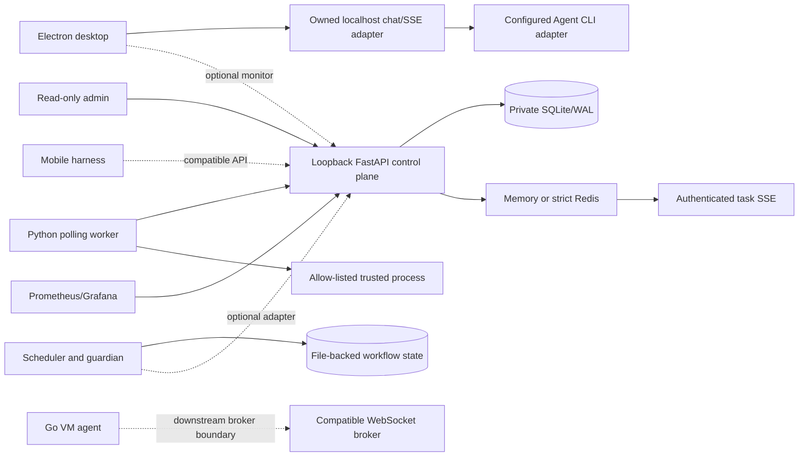

# Agent Workflow Platform

[English](README.md) | [简体中文](README.zh-CN.md)

[](https://github.com/primorLee/agent-workflow-platform/actions/workflows/ci.yml)
[](LICENSE)

**A production-derived, full-stack workbench for long-running Agent CLI work:
Electron client, local-first control plane, trusted workers, durable workflow
state, recovery loops, and operations tooling.**

This is not a prompt collection or a clean-room toy. It is the reusable core of
a retired commercial prototype that spent six months running real Agent work.
The extraction preserves the mechanisms that survived failures—stream
reconnect, session recovery, atomic claims, offline replay, guardian
hysteresis, adversarial review, rollback, private state roots, and release
gates—together with the regression tests that make those claims inspectable.

The public extraction removes product identity, credentials, customer data,
product-specific hosted-service integrations, and IC-design-specific logic while
retaining the reusable implementation and failure-driven checks. It starts from
a new Git history so removed material is not reachable. See
[PROVENANCE.md](PROVENANCE.md) and the
[public-release boundary](docs/public-release-boundary.md).


## What is here

- **Electron/Vue desktop workbench:** streamed event rendering, durable local
  conversation/artifact state, restart recovery, guarded desktop bridges,
  single-instance coordination, app-owned strict TOFU host-key pinning with explicit per-host reset, and isolated
  stable/preview package/update channels. External Agent CLI execution accepts
  only an explicit absolute executable or an explicitly signed managed-runtime
  manifest; no provider binary is bundled. The local demo needs no account,
  and hosted adapters are exact opt-ins.
- **Loopback FastAPI control plane:** SQLite-backed tasks, worker registration,
  agent heartbeat/claim/result, session liveness metadata, authenticated task
  SSE, health, rate limiting, structured redaction, and Prometheus metrics.
- **Strict event path:** single-process memory or Redis. Selecting Redis without
  a working URL/dependency/connection fails startup or readiness; it never
  silently falls back.
- **Python polling worker:** exact trusted-execution opt-in, frozen command
  resolution, minimal task environments, process-tree cleanup, private
  application-owned state, token persistence outside operator YAML, and a
  crash-safe at-least-once result queue.
- **Go WebSocket worker:** reconnect/backoff, protocol admission, cancellation,
  process supervision, and watchdog. Queue/replay and artifact upload remain
  tested composition packages; the public FastAPI server does not mount its VM
  broker protocol.
- **Workflow operating system:** dependency-aware scheduler, cross-process file
  locks, atomic checkpoints, run-state recovery, three-role adversarial review,
  guardian stall detection, failure-to-recipe learning, and six-stage `/repro`
  gates.
- **Operations layer:** localhost Compose round trip, random key bootstrap,
  HAProxy loopback bridge, SQLite WAL backup/restore, health-gated patterns,
  and a Prometheus/Grafana example for the metrics path that is actually wired.

## Architecture



The desktop chat adapter, FastAPI control plane, workflow pack, and Go VM
protocol are distinct contracts. Dotted edges are extension boundaries, not
hidden routes. The verified localhost control-plane round trip uses the Python
worker.

Read the detailed [architecture and trust boundaries](docs/architecture.md).

## Quick start: real control-plane round trip

Docker Compose is the most complete runnable path:

```text
docker compose -f deploy/local/docker-compose.local-dev.yml config --quiet
docker compose -f deploy/local/docker-compose.local-dev.yml up -d --build
python scripts/wait_for_http.py http://127.0.0.1:8100/v1/health/ready --timeout 120 --json-field database
python scripts/submit_local_task.py --timeout 60
```

The stack creates a random API key in a private named volume. FastAPI remains
bound to numeric loopback inside a shared network namespace; the worker talks
to that loopback socket and an HAProxy sidecar bridges it to host
`127.0.0.1:8100`. The submission helper discovers the key without printing it.

Stop while retaining state:

```text
docker compose -f deploy/local/docker-compose.local-dev.yml down --remove-orphans
```

Add `-v` only when you intentionally want to discard the local database, worker
state, Redis data, and generated key.

## Quick start: desktop and workflow pack

The desktop browser demo exercises the real renderer, HTTP/SSE client, durable
history, and restart recovery against an owned deterministic loopback adapter:

```text
cd apps/desktop
npm ci
npm run dev
```

Use `npm run demo:electron` for the Electron main/preload and clean-build path.
The deterministic reply is not an LLM; a real Agent CLI or hosted provider is an
explicit adapter choice.

The workflow pack runs independently with standard-library Python:

```text
python workflows/runtime/scheduler.py add "Create a deterministic smoke test" 2 --group reliability
python workflows/runtime/scheduler.py checkpoint "Run the regression and attach its output"
python workflows/runtime/guardian.py resume
```

Complete Windows, Linux, macOS, manual random-key, admin, and validation commands
are in [docs/getting-started.md](docs/getting-started.md).

## Wired features versus composition libraries

| Surface | Status in this repository |
| --- | --- |
| Task/worker/session/health/metrics HTTP APIs | Mounted by `cloud/server.py` and covered by control-plane tests |
| Task status SSE | Mounted, authenticated, tenant-scoped, and backed by the selected memory/Redis broker |
| Session `resources` | Scheduling hints only; no CPU, memory, disk, container, or OS enforcement |
| Rollout state machine | Tested library; no publish/promote route and no automatic updater |
| OS-user sandbox helper | Tested fail-closed library; not called by the public server and has no automatic cleanup |
| Go VM WebSocket protocol | Implemented and mock-broker tested; no matching route in the FastAPI demo |
| Go queue/replay and artifact upload | Tested composition packages; not all wired into default `main` |
| Observability stack | Prometheus/Grafana HTTP metrics only; no trace/log pipeline or Alertmanager delivery claim |
| Desktop hosted adapters | Optional explicit integrations; local/no-account mode is the public default |

## Production failures encoded as mechanisms

The table distinguishes implementation evidence from executable regression
evidence. A source file alone is not presented as proof of a failure mode.

| Mechanism | Failure it addresses | Evidence in this repository |
| --- | --- | --- |
| Cross-session checkpoint recovery | A process dies after useful work, but a chat summary omits the exact next action and evidence | [`scheduler.py`](workflows/runtime/scheduler.py) writes atomic checkpoints; [`guardian.py`](workflows/runtime/guardian.py) reconstructs a recovery instruction; [`validate_workflows.py`](workflows/validation/validate_workflows.py) interrupts and resumes disposable state |
| Cross-process scheduler transactions | Multiple agents report successful writes while last-writer-wins silently loses tasks | The scheduler holds an OS lock across read/modify/atomic-replace, retries bounded sharing failures, and the workflow validator launches 24 concurrent writers and requires 24 unique tasks |
| Atomic batch claim | A preview looks correct, but execution starts an empty batch or two agents claim the same task | One locked transaction selects dependency-ready work, marks it `in_progress`, and creates the batch; the validator rejects a second overlapping claim |
| Authenticated task SSE | A dropped or cross-tenant event path leaves the UI stale or leaks status | [`events_stream.py`](services/control-plane/cloud/routes/events_stream.py) subscribes before its authoritative snapshot and always unsubscribes; broker tests cover memory/Redis envelopes, readiness, failure rollback, and tenant-scoped routes |
| Crash-safe offline results | A worker completes during a network partition and the result disappears | Python [`cloud_client.py`](services/worker-agent/cloud_client.py) uses private exclusive records, atomic claims, orphan recovery, FIFO retry, and a rejected queue; Go [`queue.go`](services/vm-agent/internal/queue/queue.go) and [`replay.go`](services/vm-agent/internal/replay/replay.go) test the corresponding composition packages |
| Private application state roots | A service follows a link, adopts an unrelated directory, or writes credentials into operator configuration | Control-plane [`database.py`](services/control-plane/cloud/database.py) and worker [`storage.py`](services/worker-agent/storage.py) enforce canonical marked roots, POSIX ownership/mode, and cross-platform link/reparse checks; worker token tests require `state/agent.token` and unchanged YAML |
| SQLite WAL discipline | Concurrent claim/result/replay produces `SQLITE_BUSY`, or a backup misses acknowledged state | Control-plane tests cover atomic idempotency and claims; Go queue tests cover concurrent writers and migration; [`test_ops.py`](ops/tests/test_ops.py) restores a live-WAL backup and checks its digest |
| Guardian hysteresis | One delayed heartbeat creates a false stopped verdict or alert storm | The guardian requires three consecutive failures and a cooldown; [`verify_guardian_hysteresis.py`](scripts/verify_guardian_hysteresis.py) checks threshold, cooldown, and healthy reset without sleeping |
| Health-gated rollback | A release is promoted on process liveness, then serves broken traffic with no safe return | [`rollout.py`](services/control-plane/cloud/rollout.py) preserves immutable versions, canary evaluation, and previous-stable restoration; [`test_rollout.py`](services/control-plane/tests/test_rollout.py) covers rollback as a composition library |

The failure analysis behind these mechanisms is summarized in
[docs/production-lessons.md](docs/production-lessons.md).

## Repository map

| Path | Purpose |
| --- | --- |
| [`apps/desktop`](apps/desktop/README.md) | Electron/Vue Agent CLI workbench and owned local demo adapter |
| [`apps/admin`](apps/admin/README.md) | Read-only Vue control-plane monitor |
| [`apps/mobile`](apps/mobile/README.md) | Expo monitoring harness |
| [`services/control-plane`](services/control-plane/README.md) | Loopback FastAPI task/session/agent/SSE service plus tested rollout/sandbox libraries |
| [`services/worker-agent`](services/worker-agent/README.md) | Trusted opt-in Python polling worker with private state and offline replay |
| [`services/vm-agent`](services/vm-agent/README.md) | Go WebSocket worker and separately composed queue/replay/artifact packages |
| [`workflows`](workflows/README.md) | Scheduler, guardian, run state, review roles, commands, recipes, and schemas |
| [`deploy`](deploy/README.md) | Local stack and loopback Prometheus/Grafana example |
| `ops` | Health, locking, WAL backup, and fail-closed service patterns |

## Validation

`scripts/validate.py` is the cross-platform entrypoint. It never installs
component dependencies or contacts hosted services implicitly. CI uses
GitHub-hosted runners, localhost fixtures, dependency-file-scoped caches, and
no repository secrets.

```text
python scripts/doctor.py --component core
python scripts/validate.py --component static --component workflows
python scripts/validate.py --component control-plane
python scripts/validate.py --component worker-agent
python scripts/validate.py --component vm-agent
python scripts/validate.py --component desktop
python scripts/validate.py --component admin --component mobile
python scripts/validate.py --component operations
```

Hydrate Go modules once with `go mod download` under `services/vm-agent` before
the VM-agent command. Validation then forces `GOPROXY=off` and `GOSUMDB=off` so
a missing cache fails instead of silently reaching the network.

The static release gate parses public manifests and docs, compiles Python, runs
black-box scanner bypass cases, scans generated build trees when present, and
can inspect every reachable Git blob with `--history`. Public CI also pins and
runs Gitleaks and TruffleHog over complete history.

Opaque binary test fixtures are blocked rather than trusted by a
synthetic/example/demo filename. IC-design artifacts, archives, executable
packages, databases, logs, private-key files, and oversized or unreadable
fixtures fail closed.

## Security boundaries

- The FastAPI service supports numeric loopback binding only. The local Compose
  bridge does not weaken that server invariant and publishes only host
  `127.0.0.1:8100`.
- Control-plane SQLite and worker state use dedicated marked roots. On first
  start the final directory must be absent (or an explicitly bootstrapped empty
  control-plane root); old unmarked directories are not auto-migrated. POSIX
  validates owner/mode; Windows rejects links/reparse points and relies on an
  operator-restricted parent ACL.
- The Python and Go workers are trusted launchers, not OS sandboxes. Run
  untrusted work inside a separate VM, container, or OS identity without host
  credentials.
- Never place credentials in repository configuration, fixtures, screenshots,
  logs, task payloads, workflow state, or `VITE_*` variables.
- Report vulnerabilities through GitHub private security advisories as described
  in [SECURITY.md](SECURITY.md).

## Source-preview status

This repository publishes source only. No binary installer artifact or release
tag is published, and it includes no bundled proprietary Agent CLI, VM-agent
self-updater, or public VM-broker service. VM package, one-line install, and
local package lifecycle targets exit
with status 77 before mutation. The reviewed manual VM installer requires a
release owner to supply an external immutable binary, SHA-256 digest, detached
signature, trusted public key, API-key file, and compatible endpoint.

Before a first tag, the project still requires a release signing key and pin,
packaged third-party-license inventory, Linux installer matrix, real
systemd/rollout drill, complete artifact scans, green CI, and a fresh-clone
smoke test. These limits are part of the public contract, not omitted roadmap
fine print.

## License

[MIT](LICENSE)
