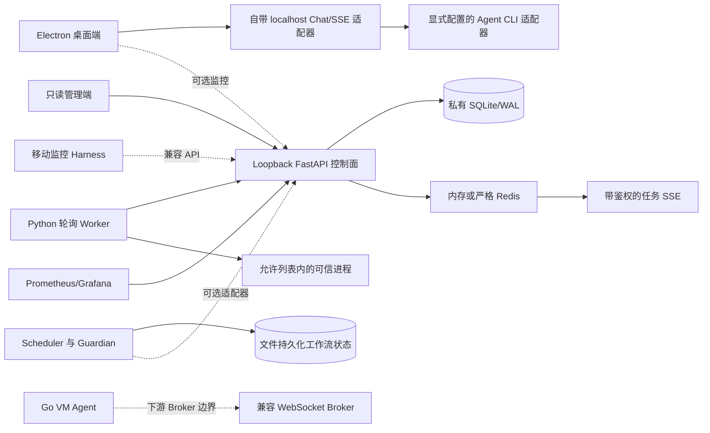

# Agent Workflow Platform

[English](README.md) | [简体中文](README.zh-CN.md)

[](https://github.com/primorLee/agent-workflow-platform/actions/workflows/ci.yml)
[](LICENSE)

**一套源自真实生产的全栈 Agent CLI 工作台：包含 Electron 客户端、本地优先控制面、可信 Worker、可恢复工作流状态和运维工具。**

这不是 Prompt 合集，也不是为了开源临时重写的玩具。它来自一个已经停止商业化、但实际运行过六个月 Agent 任务的产品原型。公开抽取保留了真正经故障磨出来的机制：流式重连、Session 恢复、原子领取、离线重放、Guardian 滞回、对抗审核、回滚、私有状态根和发布门禁；同时保留了让这些能力可以被检查的回归测试。

公开目录删除了凭据、客户数据、私有网络拓扑、原产品身份、商业账号/计费集成和 IC 设计专属 recipes，并以全新 Git 历史起步，避免被删除的私有材料仍能从旧提交取回。详见 [PROVENANCE.md](PROVENANCE.md) 和[公开发布边界](docs/public-release-boundary.md)。


## 这里真正包含什么

- **Electron/Vue 桌面工作台：**流式事件渲染、持久化的本地对话与产物、重启恢复、受约束的桌面桥接、单实例协调、应用自管的严格 SSH TOFU host-key pin 与逐 host reset，以及彼此隔离的 Stable/Preview 打包与更新通道。外部 Agent CLI 只接受显式绝对 executable，或带显式签名 manifest 的 managed runtime；仓库不捆绑任何 Provider 二进制。本地演示不需要账号，托管适配器必须精确 opt-in。
- **仅 loopback 的 FastAPI 控制面：**SQLite 任务、Worker 注册、Agent 心跳/领取/回报、Session 存活元数据、带鉴权的任务 SSE、健康检查、限流、结构化脱敏日志和 Prometheus 指标。
- **严格事件链路：**可选单进程内存或 Redis。显式选择 Redis 后，URL、依赖或连接失败都会阻断启动或 readiness，绝不会静默降级成内存模式。
- **Python 轮询 Worker：**精确的可信执行 opt-in、固定后的命令解析、最小任务环境、进程树清理、应用专属私有状态、YAML 外的 token 持久化，以及崩溃安全、至少一次语义的结果队列。
- **Go WebSocket Worker：**重连/退避、协议准入、取消、进程监管和 watchdog。Queue/replay 与产物上传保留为经过测试的组合包；公开 FastAPI 服务并未挂载对应 VM Broker 协议。
- **工作流操作系统：**依赖感知 Scheduler、跨进程文件锁、原子 checkpoint、run-state 恢复、三角色对抗审核、Guardian 停滞检测、失败沉淀 recipe，以及六阶段 `/repro` gate。
- **运维层：**localhost Compose 闭环、随机密钥引导、HAProxy loopback bridge、SQLite WAL 备份/恢复、健康门控模式，以及只覆盖真实已接线指标路径的 Prometheus/Grafana 示例。

## 架构



桌面 Chat 适配器、FastAPI 控制面、workflow pack 和 Go VM 协议是四套不同契约。虚线表示扩展边界，不代表隐藏接口。当前验证过的 localhost 控制面闭环使用 Python Worker。

完整说明见[架构与信任边界](docs/architecture.md)。

## 快速开始：真实控制面闭环

Docker Compose 是最完整的可运行路径：

```text
docker compose -f deploy/local/docker-compose.local-dev.yml config --quiet
docker compose -f deploy/local/docker-compose.local-dev.yml up -d --build
python scripts/wait_for_http.py http://127.0.0.1:8100/v1/health/ready --timeout 120 --json-field database
python scripts/submit_local_task.py --timeout 60
```

这套 Stack 会在私有 named volume 中生成随机 API Key。FastAPI 在共享 network namespace 内仍然只绑定 numeric loopback；Worker 直接访问该 loopback socket，HAProxy sidecar 再把它桥接到宿主机 `127.0.0.1:8100`。提交助手会在内存中取得密钥，但不会打印它。

停止容器但保留状态：

```text
docker compose -f deploy/local/docker-compose.local-dev.yml down --remove-orphans
```

只有明确要丢弃本地数据库、Worker 状态、Redis 数据和生成的密钥时，才额外使用 `-v`。

## 快速开始：桌面端与 workflow pack

桌面浏览器演示会使用自带的确定性 loopback 适配器，跑真实 Renderer、HTTP/SSE 客户端、持久化历史和重启恢复：

```text
cd apps/desktop
npm ci
npm run dev
```

运行 `npm run demo:electron` 可以覆盖 Electron main/preload 与干净构建路径。确定性回复不是 LLM；真实 Agent CLI 或托管 Provider 必须通过显式适配器接入。

Workflow pack 可以用标准库 Python 独立运行：

```text
python workflows/runtime/scheduler.py add "Create a deterministic smoke test" 2 --group reliability
python workflows/runtime/scheduler.py checkpoint "Run the regression and attach its output"
python workflows/runtime/guardian.py resume
```

Windows、Linux、macOS、手工随机密钥、管理端和完整验证命令见[上手指南](docs/getting-started.md)。

## 已接线能力与组合库的边界

| 能力 | 当前仓库中的真实状态 |
| --- | --- |
| 任务/Worker/Session/健康/指标 HTTP API | 由 `cloud/server.py` 挂载，并有控制面测试 |
| 任务状态 SSE | 已挂载、带鉴权、按 tenant 隔离，使用所选内存/Redis Broker |
| Session `resources` | 只是调度提示；不代表 CPU、内存、磁盘、容器或 OS 级资源已经强制隔离 |
| Rollout 状态机 | 经过测试的库；没有 publish/promote HTTP route，也没有自动更新器 |
| OS-user sandbox helper | 经过 fail-closed 测试的库；公开 Server 不会调用它，也没有自动清理 |
| Go VM WebSocket 协议 | 已实现并用 mock Broker 测试；FastAPI 演示没有对应 route |
| Go queue/replay 与产物上传 | 经过测试的组合包；并非全部接入默认 `main` |
| 可观测性 Stack | 只声明 Prometheus/Grafana HTTP 指标；不声称有 trace/log pipeline 或 Alertmanager 投递 |
| 桌面托管适配器 | 可选且必须显式接入；公开默认是本地、免账号模式 |

## 从生产故障沉淀出的机制

下表严格区分“有实现”和“有可执行回归证据”。只有一个源文件，并不会被写成已经证明某类故障得到解决。

| 机制 | 对应故障 | 当前仓库中的证据 |
| --- | --- | --- |
| 跨 Session checkpoint 恢复 | 进程做完有价值的工作后中断，但聊天摘要丢掉了精确下一步和证据 | [`scheduler.py`](workflows/runtime/scheduler.py) 原子写 checkpoint；[`guardian.py`](workflows/runtime/guardian.py) 重建恢复指令；[`validate_workflows.py`](workflows/validation/validate_workflows.py) 会真实打断并恢复临时状态 |
| 跨进程 Scheduler 事务 | 多个 Agent 都报告写入成功，但 last-writer-wins 静默丢任务 | Scheduler 用 OS 锁覆盖完整读取/修改/原子替换，并有界重试共享冲突；validator 会并发启动 24 个写入进程并要求保留 24 个唯一任务 |
| 原子批次领取 | Preview 看起来正确，真正执行时却得到空 batch，或两个 Agent 领取同一任务 | 同一个锁事务内选择依赖已就绪任务、标记 `in_progress` 并创建 batch；validator 会拒绝第二次重叠领取 |
| 带鉴权的任务 SSE | 流中断后 UI 卡死，或跨 tenant 泄漏任务状态 | [`events_stream.py`](services/control-plane/cloud/routes/events_stream.py) 先订阅、再读取权威 snapshot，并保证退订；Broker 测试覆盖内存/Redis envelope、readiness、失败回滚和 tenant-scoped route |
| 崩溃安全离线结果 | Worker 在网络分区期间完成任务，但结果永久丢失 | Python [`cloud_client.py`](services/worker-agent/cloud_client.py) 使用私有独占文件、原子 claim、孤儿恢复、FIFO 重试与 rejected queue；Go [`queue.go`](services/vm-agent/internal/queue/queue.go) 和 [`replay.go`](services/vm-agent/internal/replay/replay.go) 覆盖对应组合包 |
| 应用专属私有状态根 | 服务跟随 link、接管无关目录，或把凭据写回操作员配置 | 控制面 [`database.py`](services/control-plane/cloud/database.py) 和 Worker [`storage.py`](services/worker-agent/storage.py) 强制规范路径与 marker、POSIX owner/mode 以及跨平台 link/reparse 检查；Worker token 测试要求写入 `state/agent.token` 且 YAML 不变 |
| SQLite WAL 纪律 | 并发 claim/result/replay 触发 `SQLITE_BUSY`，或备份漏掉已确认状态 | 控制面测试覆盖原子幂等与领取；Go queue 测试覆盖并发写与迁移；[`test_ops.py`](ops/tests/test_ops.py) 会恢复在线 WAL 备份并核对 digest |
| Guardian 滞回 | 一次心跳延迟就误判停止，或制造告警风暴 | Guardian 要求连续三次失败并设置 cooldown；[`verify_guardian_hysteresis.py`](scripts/verify_guardian_hysteresis.py) 无需 sleep 即可验证阈值、冷却和健康重置 |
| 健康门控回滚 | 只看进程存活就放量，实际流量已坏且无法安全返回 | [`rollout.py`](services/control-plane/cloud/rollout.py) 保留 immutable version、canary 评估和恢复前一 stable；[`test_rollout.py`](services/control-plane/tests/test_rollout.py) 以组合库形式覆盖回滚 |

这些机制背后的失败分析见[生产经验](docs/production-lessons.md)。

## 目录

| 路径 | 用途 |
| --- | --- |
| [`apps/desktop`](apps/desktop/README.md) | Electron/Vue Agent CLI 工作台与自带本地演示适配器 |
| [`apps/admin`](apps/admin/README.md) | 只读 Vue 控制面监控端 |
| [`apps/mobile`](apps/mobile/README.md) | Expo 移动监控 Harness |
| [`services/control-plane`](services/control-plane/README.md) | Loopback FastAPI 任务/Session/Agent/SSE 服务，以及经过测试的 rollout/sandbox 库 |
| [`services/worker-agent`](services/worker-agent/README.md) | 带私有状态和离线重放的可信 opt-in Python 轮询 Worker |
| [`services/vm-agent`](services/vm-agent/README.md) | Go WebSocket Worker 与独立组合的 queue/replay/产物包 |
| [`workflows`](workflows/README.md) | Scheduler、Guardian、run state、审核角色、命令、recipes 与 schemas |
| [`deploy`](deploy/README.md) | 本地 Stack 与 loopback Prometheus/Grafana 示例 |
| `ops` | 健康检查、锁、WAL 备份和 fail-closed 服务模式 |

## 验证

`scripts/validate.py` 是跨平台统一入口。它不会偷偷安装组件依赖，也不会隐式访问托管服务。CI 只使用 GitHub-hosted runner、localhost fixture、按依赖文件限定的缓存，并且不读取仓库 secrets。

```text
python scripts/doctor.py --component core
python scripts/validate.py --component static --component workflows
python scripts/validate.py --component control-plane
python scripts/validate.py --component worker-agent
python scripts/validate.py --component vm-agent
python scripts/validate.py --component desktop
python scripts/validate.py --component admin --component mobile
python scripts/validate.py --component operations
```

验证 VM Agent 前，先在 `services/vm-agent` 运行一次 `go mod download`。之后 validator 会强制 `GOPROXY=off` 和 `GOSUMDB=off`，模块缓存不完整时直接失败，不会静默联网。

静态发布门禁会解析公开 manifest 与文档、编译 Python、运行 scanner 绕过黑盒用例、扫描已经生成的构建目录，并可通过 `--history` 检查所有可达 Git blob。公开 CI 还会固定版本，对完整历史分别运行 Gitleaks 与 TruffleHog。

不透明二进制、归档包、数据库、日志、私钥文件以及过大或不可读的 fixture 都会 fail closed；仅把文件命名为 demo、example 或 synthetic 不会得到豁免。

## 安全边界

- FastAPI 只支持 numeric loopback。Compose 的本地 bridge 不会削弱 Server 约束，宿主机也只发布 `127.0.0.1:8100`。
- 控制面 SQLite 和 Worker 状态必须位于专属 marked root。第一次启动时最终目录必须不存在（控制面也可显式引导一个空目录）；旧的未标记目录不会自动迁移或接管。POSIX 会验证 owner/mode；Windows 只拒绝 link/reparse point，并依赖操作员提供受限的 parent ACL。
- Python 与 Go Worker 都是可信任务启动器，不是 OS sandbox。对不可信任务必须另加无法读取宿主凭据的 VM、容器或 OS identity。
- 不要把凭据放进仓库配置、fixture、截图、日志、任务 payload、workflow state 或 `VITE_*` 变量。
- 安全问题请按 [SECURITY.md](SECURITY.md) 通过 GitHub private security advisory 报告。

## 源码预览状态

当前只发布源码：没有已发布的二进制安装产物或 release tag、捆绑的专有 Agent CLI、VM Agent self-updater 或公开 VM Broker 服务。VM package、一键安装和本地 package lifecycle 目标会在任何宿主变更前以状态 77 退出。经审阅的 VM 手工安装器也只有在 release owner 提供外部 immutable binary、SHA-256 digest、detached signature、可信公钥、API-key file 和兼容 endpoint 后才能使用。

第一个 tag 之前仍需准备发布签名 key 与 pin、打包后的第三方许可证清单、Linux installer matrix、真实 systemd/rollout drill、完整产物扫描、绿色 CI 和 fresh-clone smoke test。这些限制是公开契约的一部分，不是藏起来的 roadmap 小字。

## 许可证

[MIT](LICENSE)
