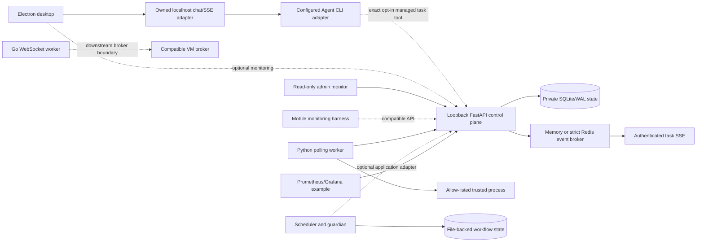

# Architecture

The repository has two independently useful base paths:

1. real model endpoint → reference/external Agent CLI → Electron streaming UI
   and native-session resume;
2. FastAPI task API → SQLite/Redis → Python worker → allow-listed process →
   result and authenticated SSE.

The checked-in reference CLI can join those paths through exactly one explicit-
opt-in tool, `awp_run_managed_task`. The model chooses whether to call it; a
Desktop message is not automatically converted into a task. The file-backed
workflow runtime and Go VM-agent packages remain separate composition
boundaries. The executable/JSONL contract for the first path is specified in
[Agent CLI protocol](agent-cli-protocol.md).

Agent Workflow Platform is a production-derived monorepo for long-running
Agent CLI work. The public extraction keeps the desktop, durable coordination,
worker, resume, and operations mechanisms, while removing the retired
product identity and private deployment adapters.

The repository deliberately exposes two runnable local paths and several
tested composition points. Those categories are kept separate below so that a
library is never presented as an already-mounted service.

## Runnable surfaces

### Desktop client and local adapter

The Electron/Vue client is a real Agent CLI workbench rather than a static UI.
It contains streamed event rendering, durable local conversations and
artifacts, session recovery, guarded desktop bridges, single-instance process
coordination, app-owned strict TOFU host-key pinning with explicit per-host reset, and isolated stable/preview
package/update channels. External Agent CLI execution accepts only an explicit
absolute executable or an explicitly signed managed-runtime manifest; the
repository neither bundles nor rebrands a provider binary. Runtime- and
hosted-service behavior stays behind exact opt-ins; the public local demo uses
an owned loopback adapter and requires no account.

The desktop chat adapter and the control plane remain different services. The
adapter on `127.0.0.1:8787` implements the renderer's chat/history/SSE contract.
The control plane on `127.0.0.1:8100` implements task, worker, session, health,
metrics, and task-event APIs. The optional tool bridge calls the control-plane
API as a client; neither service pretends to implement the other's protocol.

### Control plane

`services/control-plane/cloud/server.py` is the supported FastAPI entrypoint.
It validates both the configured host and the actual request socket and accepts
only numeric loopback binding. The mounted API provides:

- operator-key-authenticated task creation and inspection;
- worker registration, agent-token heartbeat, capacity-bounded task claim,
  leased attempt renewal, and result report;
- authenticated, tenant-scoped task status SSE;
- authenticated session metadata and liveness records;
- liveness, SQLite/broker readiness, request IDs, bounded rate limiting,
  redacted structured logs, and Prometheus metrics.

SQLite is the durable system of record. Its data directory must be a dedicated
private application root with an ownership marker; the database must be a
direct `.db` child. Link/reparse traversal, permissive POSIX ownership or mode,
and adoption of a non-empty unmarked directory fail closed. Connections use
foreign keys, WAL, a busy timeout, and explicit write transactions for claims,
idempotency, and session capacity.

Task delivery uses bounded at-least-once semantics:

1. A worker asks only for its current free-slot count. One SQLite write
   transaction claims at most that many pending tasks.
2. Every claim receives a new UUID attempt fence and an expiring lease. A
   heartbeat renews only the exact `(task_id, attempt_id, agent_id)` tuple.
3. The maintenance loop marks stale agents and sessions inactive. An expired
   task lease is requeued with a new attempt until the configured retry budget
   is exhausted, after which it becomes a durable failure.
4. A terminal result may be replayed idempotently only when its attempt,
   status, and payload match. Stale or conflicting completion attempts return
   `409` and cannot overwrite the authoritative result.

This prevents the old failure mode in which an oversized poll left work
permanently `running`, but it is not exactly-once execution. A process may have
performed an external side effect before it died; task authors must use their
own idempotency key or transaction at that boundary. SQLite schema changes are
versioned with `PRAGMA user_version`; startup migrates the lifecycle columns
and rejects a database created by a newer unsupported schema.

The task event broker is either single-process memory or Redis. Redis selection
is strict: a missing URL, dependency, or connection makes startup/readiness
fail instead of silently falling back to memory.

The local Compose stack preserves the loopback-only server invariant. The
control plane and Python worker share one network namespace and communicate on
`127.0.0.1:8100`; a small HAProxy sidecar in that same namespace exposes an
internal bridge port, which Docker publishes only as host
`127.0.0.1:8100`. A bootstrap container creates a random API key in a private
named volume.

Session `resources` values are scheduling hints and compatibility metadata.
The session registry does not allocate or enforce CPU, memory, disk,
containers, or operating-system isolation.

### Python worker

The Python worker is an outbound-only polling adapter. Execution is disabled
unless the host process contains the exact
`AWP_TRUSTED_TASK_EXECUTION_OPT_IN=1` value. It resolves configured command
basenames once, launches without an implicit shell, constructs a minimal task
environment, bounds output, and performs best-effort process-tree cleanup.

Its `work_dir` is a dedicated application-owned state root. The final path must
not exist on first start; later starts accept only the worker's exact marker.
POSIX also enforces current ownership and private modes; Windows rejects
links/reparse points and requires an operator-restricted parent ACL. Old
unmarked directories are neither adopted nor migrated. The registered token
lives under `state/agent.token`, never in the
operator YAML. Status, logs, task attempts, and the at-least-once offline result
queue use exclusive creation, atomic replacement, identity rechecks, and
private paths.

This worker is a trusted launcher, not an OS sandbox. An allowed interpreter
can do anything available to the worker's operating-system identity. Untrusted
or multi-tenant jobs require a separate container, VM, or OS account without
mounted credentials.

### Go VM agent

The Go agent is a separate outbound WebSocket worker with handshake,
authentication, heartbeat, reconnect/backoff, task admission/cancellation,
process supervision, and watchdog behavior. The checked-in `main` wires the
WebSocket dialer and a deliberately small `echo` runner. The public FastAPI
control plane does not mount the corresponding VM broker endpoint.

On its shipped Linux target, each task runs in an isolated process group:
explicit or context cancellation removes descendants, output pipes are drained,
and only then is terminal completion emitted. Other operating systems keep a
direct-child fallback for build compatibility, not a process-tree guarantee.

SQLite queue/replay and artifact-upload packages remain tested composition
libraries, but are not all wired into the default Go `main`. There is no
self-updater or published VM binary; package and one-line lifecycle paths fail
closed. The reviewed manual installer can be
used only after a release owner supplies an external immutable artifact,
digest, detached signature, and trusted public key.

### Workflow layer

The workflow pack is an independent standard-library Python coordination
toolkit. Atomic file-backed run state, dependency-aware claims, OS locking,
checkpoints, guardian hysteresis, role-separated review, incident recipes, and
six-stage reproduction gates let work survive process and context boundaries.
The scheduler records and claims work; it does not spawn Agents or execute the
claimed tasks. Guardian detects stalls and renders a resume instruction; it
does not restart a process or prove that recovery succeeded.

It does not share the control-plane database or broker by default. A downstream
application may translate its file contracts into API tasks and events; that is
an adapter boundary, not a checked-in direct connection.

### Admin, mobile, and operations

The Vue admin app is a read-only monitor for control-plane health, tasks, and
session metadata. The Expo app is a monitoring harness, not a management or
execution plane. The deployment layer contains the localhost round-trip stack,
health/locking/WAL-backup patterns, and a Linux-host-network
`observability-stack.yml` in which Prometheus scrapes the wired `/metrics`
endpoint and Grafana provisions the checked-in dashboard.

The observability example does not claim trace collection, log transport,
Alertmanager delivery, TLS, backup, or hosted monitoring.

## Tested composition libraries

| Library | What is tested | What is not claimed |
| --- | --- | --- |
| `cloud/rollout.py` | Immutable version records, deterministic cohorts, canary evaluation, previous-stable rollback, strict release URL policy | No public publish/promote HTTP route and no automatic updater |
| `cloud/sandbox_manager.py` | Fail-closed creation of a fresh, marked OS-user workspace | Not called by the public server; no automatic cleanup; not a general container sandbox |
| Go `internal/queue` and `internal/replay` | WAL queue locking, idempotency, FIFO claim/reclaim, retry classification, bounded replay | Not wired into the default Go `main` |
| Go `internal/artifact` | Streaming upload, checksum verification, retry, completion reporting | No control-plane artifact route in this repository |

Because the sandbox helper is only a composition library, workspace lifecycle
and cleanup remain caller and adapter responsibility.

## Trust boundaries

- The public server binds only to numeric loopback. Remote exposure requires a
  separately reviewed deployment adapter; changing one environment value is
  not a supported bypass.
- Browser clients never receive server-side secret files. The admin key is
  entered at runtime and kept only in `sessionStorage`.
- The operator key registers workers; workers then use independently generated,
  hashed-at-rest agent tokens.
- Task payloads, arguments, output, artifacts, workflow state, and local traces
  may still contain user data. They are not safe to publish merely because the
  repository source was sanitized.
- Public CI uses GitHub-hosted runners, localhost fixtures, and no private
  network or repository credentials.
