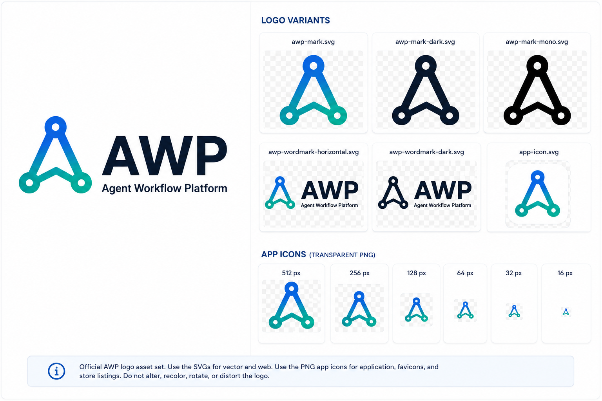

# AWP brand assets

Use the SVG files for web and vector layouts. Use the transparent PNG marks for application icons, favicons, and store-listing source material.

- `awp-mark.svg` — primary gradient mark
- `awp-mark-dark.svg` — solid Deep Navy mark
- `awp-mark-mono.svg` — single-color black mark
- `awp-wordmark-horizontal.svg` — primary horizontal wordmark
- `awp-wordmark-dark.svg` — solid Deep Navy horizontal wordmark
- `app-icon.svg` — rounded application icon
- `app-icons/app-icon-{size}.png` — transparent 512, 256, 128, 64, 32, and 16 px marks

The desktop copy at `apps/desktop/public/awp-mark.svg` mirrors the primary mark. Do not rotate, distort, recolor, or change the node geometry.